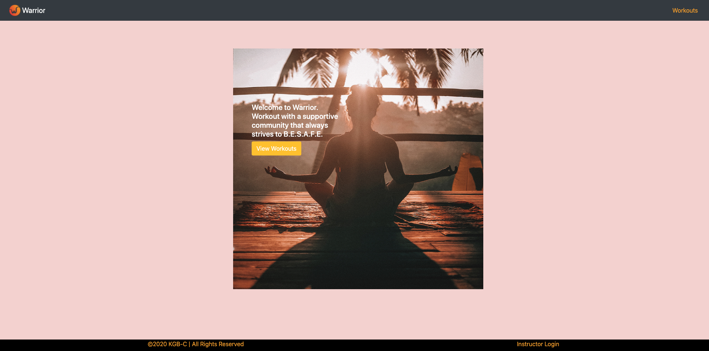

# Warrior
# 

By: Project Team 4 
<i>These are the terms of installation for this code.<i>

## Table of Contents

### 1. Description  

### 2. User Story  

### 3. Credits  

### 4. New Technology  

### 5. Usage  

### 6. License  

## Description

<!-- <i> Elevator Pitch It’s Sunday night and you’re dreading the thought of explaining fraction decimals to your 9 year old, again. If only, you could have a real teacher, do it for you. Now you can, introducing Maestro. Choose your subject and get matched with professional educators  for a live remote lesson.<i> -->
<i> The Web application is designed to allow people to find a safe place to workout in these uncertain times. Warrior allows users to find Warrior safe workouts that adhere to social distancing rules for a fun experience. It is a fully functioning CRUD application, in that an instructor can create an account, login in to see their dashboard, create and update a workout as well as delete. <i>

## User Story

<i>
As a remote learner,  
I want to find an place to safely workout during Covid-19, 
So that I can workout without fear of working out in an unsafe area.
<i>

## Credits

<i>
This was a team project completed as Project 3 for the Georgia Tech, FullStack Flex program.
<i>

## New Technology
<i>
The application requires firebase and react-router package in order to authenticate users.
<i>

## Usage

[Deployed Heroku link](https://kgbc-warrior.herokuapp.com/)

## Screenshot

## Licensing

<i>
MIT License

Copyright (c) [2020][Jennifer Daeumler, Kaleb Garrison,Christina Starr, Maya Stucky]

Permission is hereby granted, free of charge, to any person obtaining a copy
of this software and associated documentation files (the "Software"), to deal
in the Software without restriction, including without limitation the rights
to use, copy, modify, merge, publish, distribute, sublicense, and/or sell
copies of the Software, and to permit persons to whom the Software is
furnished to do so, subject to the following conditions:

The above copyright notice and this permission notice shall be included in all
copies or substantial portions of the Software.

THE SOFTWARE IS PROVIDED "AS IS", WITHOUT WARRANTY OF ANY KIND, EXPRESS OR
IMPLIED, INCLUDING BUT NOT LIMITED TO THE WARRANTIES OF MERCHANTABILITY,
FITNESS FOR A PARTICULAR PURPOSE AND NONINFRINGEMENT. IN NO EVENT SHALL THE
AUTHORS OR COPYRIGHT HOLDERS BE LIABLE FOR ANY CLAIM, DAMAGES OR OTHER
LIABILITY, WHETHER IN AN ACTION OF CONTRACT, TORT OR OTHERWISE, ARISING FROM,
OUT OF OR IN CONNECTION WITH THE SOFTWARE OR THE USE OR OTHER DEALINGS IN THE
SOFTWARE.<i>

